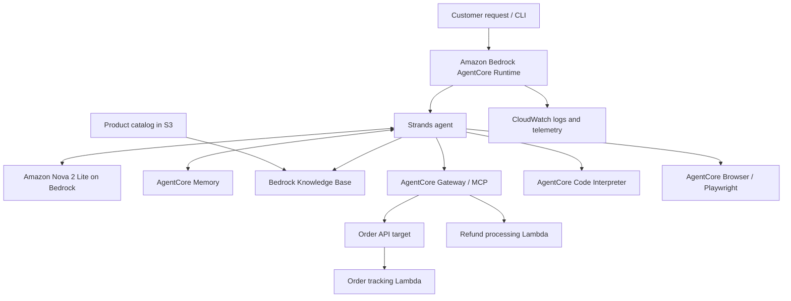

# AWS Customer Support Agent

**Capstone project for my AWS Agentic Engineer track · Passed project review**

A cloud-deployed customer support agent built with **Amazon Bedrock AgentCore, the Strands SDK, and Amazon Nova 2 Lite**. The agent combines natural-language reasoning with backend operations, retrieval-augmented generation (RAG), persistent customer memory, sandboxed calculations, and browser automation.

I completed this capstone from course-provided scaffolding and backend examples, implementing the agent logic, configuring AWS integrations, deploying the container, and troubleshooting failures across service boundaries. The result demonstrates how I connect an LLM to useful application capabilities and operate that application in AWS.

**Start here:** [Agent implementation](main.py) · [Test screenshots](screenshots/) · [Project reflection](reflection.md)

## What the agent does

| Capability | Implementation | Example request |
| --- | --- | --- |
| Order tracking | MCP tools exposed through AgentCore Gateway and an API-backed order service | “Track order ORD-001.” |
| Refund workflows | Gateway tools backed directly by AWS Lambda | “Initiate a refund for order ORD-002.” |
| Product and policy questions | Bedrock Knowledge Base retrieval over the product catalog | “What are the Platinum loyalty benefits?” |
| Customer memory | AgentCore Memory with semantic and preference strategies | “Do you remember my name and communication preference?” |
| Loyalty calculations | Python execution through AgentCore Code Interpreter | “Calculate my Gold-tier discount on a $150 order.” |
| Live website access | AgentCore Browser with Playwright through the Strands browser tool | “Visit Udacity and report its actual page title.” |

The backend examples use fictional customers, orders, and simulated refunds. They do not connect to a live store or payment processor.

## Engineering skills demonstrated

| Skill | Evidence in this project |
| --- | --- |
| Agent orchestration | Build a Strands `Agent` with a Bedrock model, local tools, dynamically discovered MCP tools, and lifecycle hooks. |
| AWS application deployment | Package the application in a Linux ARM64 container and deploy it to AgentCore Runtime using Docker and Amazon ECR. |
| Backend integration | Connect API-based and Lambda-based Gateway targets through a common MCP interface. |
| RAG implementation | Call the Bedrock `Retrieve` API and supply retrieved catalog passages to the agent through a dedicated tool. |
| Persistent context | Retrieve customer-scoped memories before processing a request and save the completed interaction through Strands hooks. |
| Tool-based computation | Move loyalty calculations into Code Interpreter and provide a limited tier-only fallback when execution raises an error. |
| IAM troubleshooting | Diagnose denied Memory, Knowledge Base, and Browser operations and scope runtime permissions to the required resources. |
| Reliability and observability | Log Gateway tool discovery, catch connection and timeout failures, and return a user-facing support message. Investigate exceptions in CloudWatch. |
| Dependency management | Use `uv`, a dependency lock file, a Python version pin, and a matching container image. |
| Integration verification | Exercise the deployed agent across six capability areas and retain screenshots as review evidence. |

## Architecture



### Request flow

1. AgentCore receives a JSON payload containing a prompt and optional customer and session identifiers.
2. `MemoryHook` loads the configured memory namespaces. Its message callback retrieves relevant customer facts and preferences and prepends them to the user's message.
3. `MCPClient` connects to the Gateway, discovers its tools, and adds them to the knowledge-base, loyalty, and browser tools.
4. The Strands agent uses the Bedrock model to select tools and compose an answer. The Gateway connection remains open while those tools are used.
5. An after-invocation hook saves the interaction to AgentCore Memory, and the handler returns the assistant's response text.
6. Exceptions within Gateway setup and agent execution are logged and converted into a plain-language service-unavailable response.

### Foundation for scaling

The application separates agent orchestration from backend tools, knowledge retrieval, and persistent memory. These boundaries allow backend operations and storage to evolve independently of the conversation layer. AgentCore Runtime supplies managed hosting, while Lambda provides independently deployed backend functions.

This capstone demonstrates that architecture and its integrations; it does not claim a measured throughput, latency target, or production availability guarantee. Load testing, quotas, cost controls, durable business data, and stronger authorization are the next steps toward a production service.

## Repository layout

```text
.
├── main.py                         # Agent entrypoint, memory hooks, and tools
├── lambda/
│   ├── order_tracker.py            # Demonstration order/customer API handler
│   ├── refund_processor.py         # Demonstration refund tool handler
│   └── lambda_schema               # Refund tools and their input schemas
├── product_catalog.txt             # Knowledge-base source content
├── pyproject.toml                  # Dependencies and package configuration
├── uv.lock                         # Resolved Python dependencies
├── .python-version                 # Python 3.13
├── .bedrock_agentcore.yaml          # Configuration from the capstone deployment
├── .bedrock_agentcore/
│   └── customer_support_agent/
│       └── Dockerfile              # Agent container build
├── screenshots/                    # Deployed capability demonstrations
└── reflection.md                   # Design decisions and lessons learned
```

## Run the project

### Prerequisites

- Python **3.13**, [uv](https://docs.astral.sh/uv/), Git, and AWS CLI v2.
- An AWS account with credentials permitted to use the configured resources and model.
- Docker Desktop with its Linux engine running for `--local-build` deployment.
- The AWS resources described below. Local execution also uses AWS services and is not an offline demo.

The commands below use **PowerShell**, matching the development environment. AWS usage, container storage, and cloud builds can incur charges.

**CLI compatibility:** this repository uses the Python `bedrock-agentcore-starter-toolkit` dependency and its `configure`, `deploy`, and `invoke` commands. AWS now recommends the newer `@aws/agentcore` CLI for new projects; its workflow is different. The instructions here reproduce this capstone's existing setup. See the [toolkit's migration notice](https://github.com/aws/bedrock-agentcore-starter-toolkit).

### 1. Install dependencies and verify your account

```powershell
git clone https://github.com/jmoriwa/ai_suport_agent.git
cd ai_suport_agent
uv sync --locked
aws sts get-caller-identity
```

Configure AWS credentials using your organization's approved login method first. Verify that the returned account is the account where you intend to deploy. Python is constrained to `>=3.13,<3.14` because browser testing exposed an asyncio compatibility problem under Python 3.14.

### 2. Provision and configure the AWS integrations

Infrastructure is configured separately; this repository does not include Terraform or CDK provisioning.

| Resource | Setup |
| --- | --- |
| Order service | Deploy `lambda/order_tracker.py` with handler `order_tracker.lambda_handler`. Expose `GET /orders/{order_id}`, `GET /customers/{customer_id}/orders`, and `GET /customers/{customer_id}` through the API integration used by your Gateway target. |
| Refund service | Deploy `lambda/refund_processor.py` with handler `refund_processor.lambda_handler`. Register it as a direct Lambda Gateway target using `lambda/lambda_schema`. |
| AgentCore Gateway | Register both targets and confirm MCP tool discovery. Configure target invocation permissions for the Gateway's role. |
| Bedrock Knowledge Base | Upload `product_catalog.txt` to S3, configure an embeddings model and vector store, and sync the data source. The capstone setup uses Titan Text Embeddings v2 with OpenSearch Serverless. |
| AgentCore Memory | Configure semantic and user-preference strategies with customer-scoped namespaces such as `cs_agent/{actorId}/facts` and `cs_agent/{actorId}/preferences`. |
| Bedrock model | Provide access to the configured inference profile, `global.amazon.nova-2-lite-v1:0`, and its required model resources. |
| Browser and Code Interpreter | Permit the runtime role to start, use, and stop the built-in tool sessions. |

Update the constants near the top of `main.py` with **your own resources**:

```python
GATEWAY_URL = "https://<your-gateway-endpoint>/mcp"
KB_ID = "<your-knowledge-base-id>"
REGION = "us-east-1"
MEMORY_ID = "<your-memory-id>"
```

These are Python constants; the current implementation does not load them from a `.env` file. The MCP transport also does not configure an authentication header or request signing. A Gateway that requires inbound authentication needs the corresponding authenticated transport before it will work with this code.

The committed `.bedrock_agentcore.yaml` contains paths and resource identifiers from the original deployment. For a new account or checkout, back it up and generate a configuration for your environment:

```powershell
Move-Item .bedrock_agentcore.yaml .bedrock_agentcore.yaml.local-backup
uv run agentcore configure --entrypoint main.py --name customer_support_agent
```

Keep that local backup out of commits. Review the generated configuration, including source paths, account, execution role, region, and `container_runtime: docker`. Use the long-term memory resource referenced by `MEMORY_ID`; the toolkit's automatically created short-term-only memory does not replace the semantic and preference strategies used by this application.

### 3. Check the runtime execution role

The caller's AWS permissions and the deployed agent's execution-role permissions are separate. In this project, runtime failures were resolved by granting the execution role access to the resources it actually calls.

| Integration | Application permissions to review |
| --- | --- |
| Knowledge Base | `bedrock:Retrieve` on the selected knowledge base |
| Memory | `bedrock-agentcore:GetMemory`, `RetrieveMemoryRecords`, and `CreateEvent` on the selected memory resource |
| Browser | `bedrock-agentcore:StartBrowserSession`, `GetBrowserSession`, `StopBrowserSession`, and `ConnectBrowserAutomationStream` for the browser resource |
| Code Interpreter | `bedrock-agentcore:StartCodeInterpreterSession`, `InvokeCodeInterpreter`, and `StopCodeInterpreterSession` for the interpreter resource |
| Model | Bedrock model invocation permissions appropriate to the inference profile |

This table identifies the application calls, not a complete deployment policy. Deployment, ECR, logging, Gateway targets, and knowledge-base ingestion have additional role requirements. Review the [AgentCore permissions reference](https://docs.aws.amazon.com/service-authorization/latest/reference/list_bedrock-agentcore.html) and [Bedrock Knowledge Base permissions](https://docs.aws.amazon.com/bedrock/latest/userguide/knowledge-base-prereq-permissions-general.html).

### 4. Run locally

Start the application server:

```powershell
uv run python main.py
```

In a second PowerShell terminal, send a request:

```powershell
$payload = @{
    prompt = "What are the benefits of the Platinum loyalty tier?"
    customer_id = "CUST-123"
    session_id = "local-demo"
} | ConvertTo-Json

Invoke-RestMethod -Uri "http://localhost:8080/invocations" -Method Post -ContentType "application/json" -Body $payload
```

`main.py` starts the runtime server by default; passing a JSON argument directly to that command does not run the optional local CLI helper. Local requests use your local AWS credentials, so a successful local call does not by itself verify the deployed execution role. The [AgentCore local endpoint](https://docs.aws.amazon.com/bedrock-agentcore/latest/devguide/runtime-get-started-code-deploy-python.html) accepts requests at `/invocations`.

### 5. Deploy to AWS

```powershell
docker version
uv run agentcore deploy --local-build
```

Docker should report both Client and Server information. The deployment configuration targets Linux ARM64, and the container uses Python 3.13. For a cloud build using the toolkit's CodeBuild path, run `uv run agentcore deploy` without `--local-build`; this requires the corresponding CodeBuild permissions.

### 6. Invoke the deployed agent

```powershell
$env:AGENT_SESSION_ID = [guid]::NewGuid().ToString()
uv run --% agentcore invoke --session-id %AGENT_SESSION_ID% "{\"prompt\": \"What is the status of order ORD-001?\", \"customer_id\": \"CUST-123\", \"session_id\": \"order-demo\"}"
```

Keep the invocation on one line. PowerShell's `--%` preserves the escaped JSON for the native CLI. It is PowerShell-specific and should not be copied into Bash. Save code changes, redeploy, and use a new runtime session when testing an updated deployment.

### Understanding session identifiers

| Identifier | Purpose |
| --- | --- |
| CLI `--session-id` | Selects the AgentCore runtime session. The example generates a UUID. |
| Payload `session_id` | Passed to the application's memory hook to label stored events. A UUID is generated if omitted. |
| Payload `customer_id` | Used as the memory actor and to format retrieval namespaces. Keep it consistent for cross-session recall. |
| Browser `session_name` | A separate tool argument. The installed browser tool requires 10–36 lowercase letters, digits, or hyphens, such as `udacity-browser-test`. |

The handler creates a new Strands agent per invocation. Cross-request context is supplied through retrieved long-term memory; it does not explicitly reload a full chat transcript by runtime session ID. Memory extraction is asynchronous, so recall may not be available immediately after saving an interaction.

## Demonstrations and evidence

| Scenario | Evidence | What to inspect |
| --- | --- | --- |
| Order tracking | [Test 1](screenshots/test_1.png) | Shipment status, carrier, and tracking number |
| Refund processing | [Test 2](screenshots/test_2.png) | Gateway-backed refund response and generated ID |
| Knowledge retrieval | [Test 3](screenshots/test_3.png) | Catalog-backed Platinum benefits |
| Cross-session memory | [Test 4A](screenshots/test_4a.png), [Test 4B](screenshots/test_4b.png) | Recall of Jane's name and preference; inspect the prompt shown in each capture |
| Loyalty calculation | [Test 5](screenshots/test_5.png) | Points redemption, tier discount, final total, and remaining points |
| Browser automation | [Test 6](screenshots/test_6.png) | Retrieved Udacity page title |

These are manual integration demonstrations, not a load-test report or an automated regression suite. Some captures also show limitations worth addressing: a simulated refund defaults to $0 when an amount is omitted, and remembered context can distract the model from the current request. Review approval establishes completion of the capstone requirements; it does not replace production validation.

To reproduce the memory scenario, introduce yourself in one request and ask for recall in another, keeping the same `customer_id` and changing both the runtime UUID and payload `session_id`. To reproduce the browser scenario, ask the agent to initialize `udacity-browser-test`, navigate to `https://www.udacity.com`, and report the actual page title without guessing if retrieval fails.

## Troubleshooting and lessons learned

| Symptom | Diagnosis or resolution |
| --- | --- |
| `main.py` not found | Run commands from the cloned repository directory. Activating a virtual environment does not change the working directory. |
| Docker works but local deployment says no engine exists | Inspect `.bedrock_agentcore.yaml`; the earlier configuration had retained `container_runtime: none`. |
| Runtime returns HTTP 500 | Inspect the CloudWatch traceback. A conversational explanation alone is not reliable evidence of the cause. |
| Knowledge Base or Memory access denied | Check the execution role against the exact resource in the exception, including the distinction between configured and auto-created memory. |
| Browser triggers asyncio task errors | The capstone moved the project and container to Python 3.13 after isolating a Python 3.14 compatibility issue. |
| Browser rejects session names | Use a valid tool session name such as `udacity-browser-test`, rather than a short label such as `t6`. |
| Gateway unavailable | The handler logs the exception and returns a support-service message. Connection setup is inside the `try` block. |
| PowerShell log output reports a `charmap` error | Set UTF-8 output before retrieving logs. |

Use the runtime ID reported by your deployment to read logs:

```powershell
$env:PYTHONUTF8 = "1"
$env:PYTHONIOENCODING = "utf-8"
[Console]::OutputEncoding = [System.Text.UTF8Encoding]::new()
$runtimeId = "<your-agent-runtime-id>"
aws logs tail "/aws/bedrock-agentcore/runtimes/$runtimeId-DEFAULT" --since 15m --region us-east-1 --format short
```

Gateway success logs include the discovered tool count. Timeout, connection, and general exception handlers return a safe customer-facing message. Raw tracebacks remain operational data and should be restricted in CloudWatch. Memory and browser initialization occur before that `try` block, and tool errors returned as data may be handled by the model rather than raising an exception; comprehensive failure handling remains a production improvement.

## Production roadmap

- **Identity and authorization:** derive customer identity from authentication, enforce customer ownership of orders, and add authenticated Gateway access. Customer-scoped memory namespaces alone are not an authorization boundary.
- **Durable transactions:** replace mock dictionaries and simulated refunds with a database and payment integration. Add amount validation, eligibility checks, confirmation, idempotency, and audit records.
- **Reliable answers:** validate tool responses, distinguish missing data from service failures, require grounded answers for policies, and escalate uncertain outcomes to a human.
- **Memory quality and privacy:** retain original user input separately from injected context, prevent unsupported generated statements from becoming persistent facts, and add retention and deletion controls.
- **Safe computation and browsing:** validate numeric inputs and categories before generating code, use decimal arithmetic for money, and apply destination and action controls to browser use.
- **Repeatable delivery:** provision resources and IAM policies with CDK or Terraform, externalize environment configuration, and add CI checks plus staged deployments. Pin container dependencies using the lock file; the current Docker build installs from `pyproject.toml`.
- **Scale and operations:** measure concurrent-session behavior, latency, token usage, tool failure rates, and cost. Add suitable timeouts, bounded retries for safe operations, resource cleanup, dashboards, and alarms.
- **Evaluation:** maintain regression conversations for retrieval accuracy, memory isolation, tool selection, and failure responses. No performance benchmark or automated evaluation score is claimed here.

## Project outcome

This capstone passed review for integrating an AWS-hosted support agent with MCP backend tools, knowledge retrieval, customer memory, Code Interpreter, and browser capabilities. The implementation and troubleshooting work demonstrate my ability to build, deploy, inspect, and improve an agentic application across multiple AWS services.

See [my reflection](reflection.md) for the Python compatibility decision, the Knowledge Base permission issue, and the next steps toward production.
